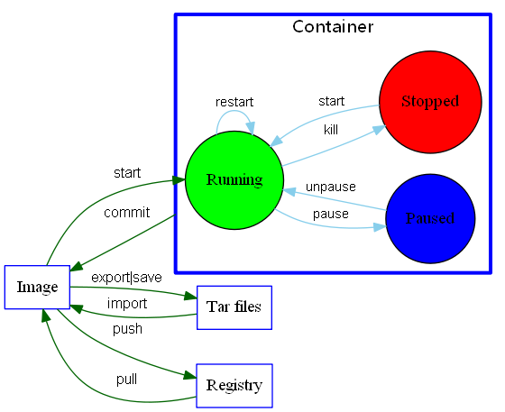

# Docker 命令大全

## 容器生命周期管理

* [run](/docker/00-basic/command/run.md) 创建一个新的容器并运行一个命令
* [start/stop/restart](/docker/00-basic/command/start-stop-restart.md)   启动/停止/重启一个容器
* [kill](/docker/00-basic/command/kill.md)   杀掉一个运行中的容器
* [rm](/docker/00-basic/command/rm.md)   删除一个或多个容器
* [pause/unpause](/docker/00-basic/command/pause-unpause.md) 暂停/恢复容器中所有的进程
* [create](/docker/00-basic/command/create.md)   创建一个新的容器但不启动它
* [exec](/docker/00-basic/command/exec.md)   在运行的容器中执行命令

## 容器操作

* [ps](/docker/00-basic/command/ps.md)   列出容器
* [inspect](/docker/00-basic/command/inspect.md) 获取容器/镜像的元数据
* [top](/docker/00-basic/command/top.md) 查看容器中运行的进程信息
* [attach](/docker/00-basic/command/attach.md)   连接到正在运行中的容器
* [events](/docker/00-basic/command/events.md)   从服务器获取实时事件
* [logs](/docker/00-basic/command/logs.md)   获取容器的日志
* [wait](/docker/00-basic/command/wait.md)    阻塞运行直到容器停止，然后打印出它的退出代码
* [export](/docker/00-basic/command/export.md)   将文件系统作为一个tar归档文件导出到STDOUT
* [port](/docker/00-basic/command/port.md)   列出指定的容器的端口映射

## 容器rootfs命令

* [commit](/docker/00-basic/command/commit.md)   从容器创建一个新的镜像
* [cp](/docker/00-basic/command/cp.md)   用于容器与主机之间的数据拷贝
* [diff](/docker/00-basic/command/diff.md)   检查容器里文件结构的更改

## 镜像仓库

* [login/logout](/docker/00-basic/command/login-logout.md)   登陆/登出Docker镜像仓库
* [pull](/docker/00-basic/command/pull.md)   从镜像仓库中拉取或者更新指定镜像
* [push](/docker/00-basic/command/push.md)   将本地的镜像上传到镜像仓库
* [search](/docker/00-basic/command/search.md)   从Docker Hub查找镜像

## 本地镜像管理

* [images](/docker/00-basic/command/images.md)   列出本地镜像
* [rmi](/docker/00-basic/command/rmi.md) 删除本地一个或多少镜像
* [tag](/docker/00-basic/command/tag.md) 标记本地镜像，将其归入某一仓库
* [build](/docker/00-basic/command/build.md) 用于使用 Dockerfile 创建镜像
* [history](/docker/00-basic/command/history.md) 查看指定镜像的创建历史
* [save](/docker/00-basic/command/save.md)  将指定镜像保存成 tar 归档文件
* [load](/docker/00-basic/command/load.md)  导入使用 docker save 命令导出的镜像
* [import](/docker/00-basic/command/import.md)   从归档文件中创建镜像
