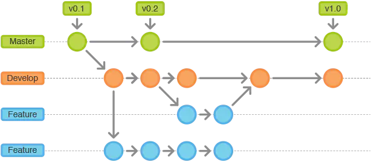

# Git Flow

## Git Flow安装及初始化

```shell
# 在Debian/Ubuntu中安装
apt-get install gitflow

# 在Centos/RedHat中安装
yum install gitflow

# 在Mac下的安装
brew install git-flow

# 初始化仓库
git flow init
```

## Git Flow工作流程


分支 | 说明
-- | --
master | 时常保持着软件可以正常运行的状态。由于要维持这一 状态，所以不允许开发者直接对 master 分支的代码进行修改和提交。其他分支的开发工作进展到可以发布的程度后，将会与 master分支进行合并，而且这一合并只在发布成品时进行。发布时会附加包含版本编号的Git标签（Tag）。
develop | 开发过程中的代码中心分支。与master分支一样，这个分支也不允许开发者直接进行修改和提交。程序员要以develop分支为起点新建feature分支，在feature分支中进行新功能的开发或者代码的修正。也就是说，develop分支维持着开发过程中的最新源代码，以便程序员创建feature分支进行自己的工作。
feature | 以develop分支为起点，是开发者直接更改代码发送提交的分支。与develop分支合并后，已经完成工作的feature分支就失去了作用，可以在适当的时候删除。
release | 基于最新develop分支创建，当新功能足够发布一个新版本，从develop分支创建一个release分支作为新版本的起点，用于测试，所有的测试bug在这个分支改。测试完成后合并到master并打上版本号，同时也合并到develop，更新最新开发分支。
hotfix | 并不是预期中计划出现的分支。它是一个紧急应对措施，只有当前发布的版本中出现BUG或漏洞，而且其严重程度要求开发方必须立刻处理，无法等到下一个版本发布时，hotfix分支才会 被创建。 因此，hotfix 分支都是以发布版本的标签或master分支为起点。借助hotfix分支，可以在不影响develop分支正常开发的情况下，由其他开发者处理成品的修正工作。

### Master/Devlop分支

所有在Master分支上的Commit应该打上Tag，一般情况下Master不存在Commit，Devlop分支基于Master分支创建。


### Feature分支

Feature分支做完后，必须合并回Develop分支, 合并完分支后一般会删点这个Feature分支，毕竟保留下来意义也不大。



```shell
git checkout develop
git pull origin develop
git flow feature start xxx
# 在feature/xxx分支中实现目标功能并进行提交
git commit -am ""
git flow feature finish xxx
git push origin develop
```

### Release分支

Release分支基于Develop分支创建，打完Release分支之后，我们可以在这个Release分支上测试，修改Bug等。同时，其它开发人员可以基于Develop分支新建Feature (记住：一旦打了Release分支之后不要从Develop分支上合并新的改动到Release分支)发布Release分支时，合并Release到Master和Develop， 同时在Master分支上打个Tag记住Release版本号，然后可以删除Release分支了。


```shell
git checkout develop
git pull origin develop
git flow release start '1.0.0'
# 在release /1.0.0分支中实现目标功能并进行提交
git commit -am ""
git flow release finish '1.0.0'
git checkout develop
git push origin develop
git push origin master
git push --tags
```

### Hotfix分支

hotfix分支基于Master分支创建，开发完后需要合并回Master和Develop分支，同时在Master上打一个tag。


```shell
git checkout master
git pull origin master
git flow hotfix start '1.0.1' '1.0.0'
# 在hotfix /1.0.1分支中实现目标功能并进行提交
git commit -am ""
git flow hotfix finish 1.0.1
git checkout develop
git push origin develop
git push origin master
git push --tags
```
