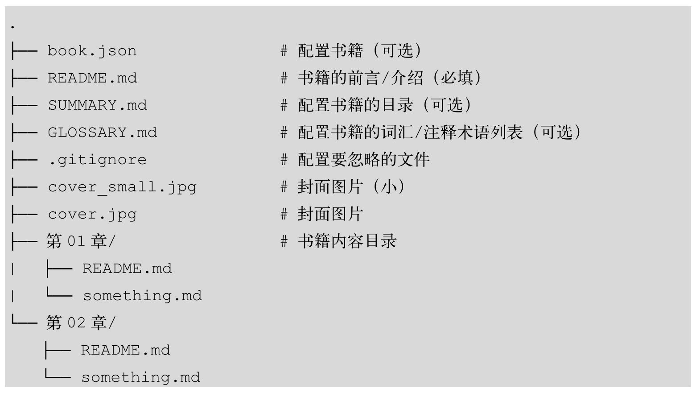
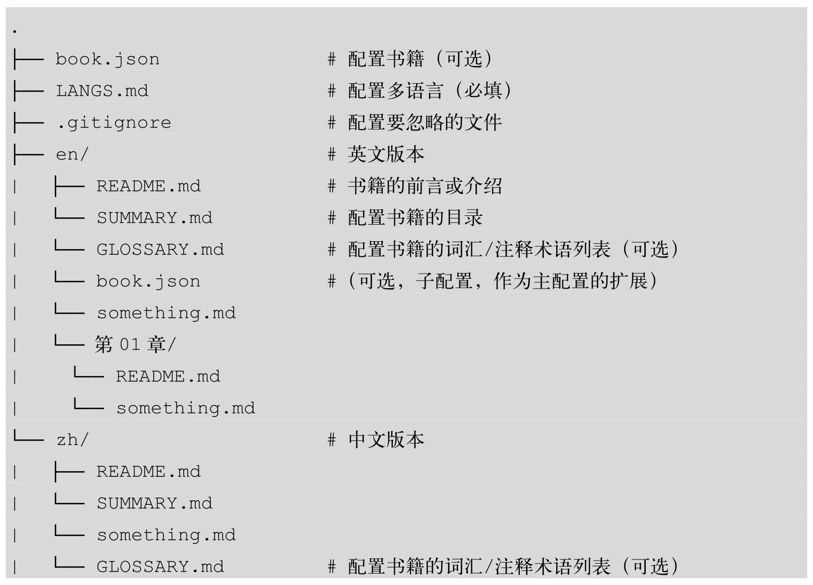
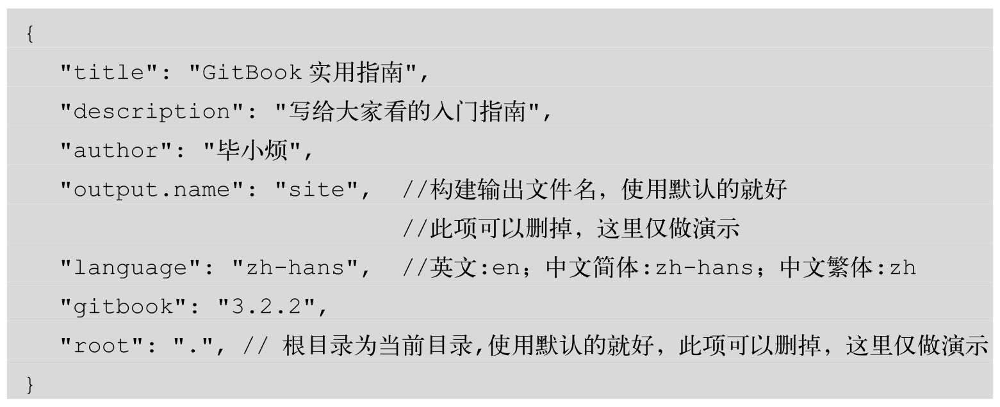
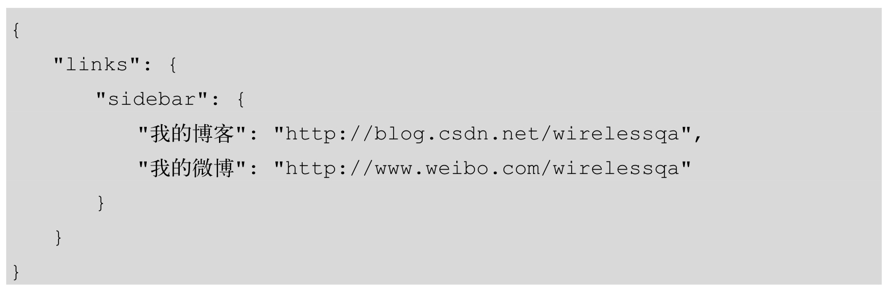
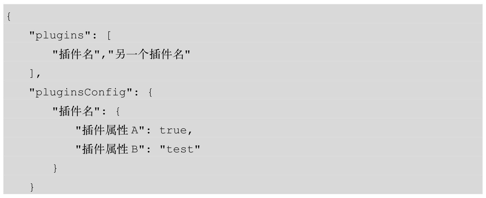
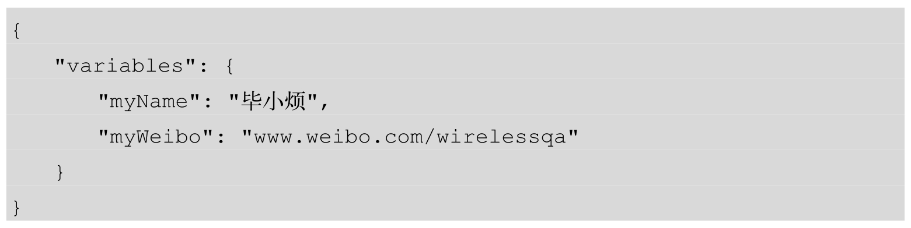

# GitBook 配置

GitBook的项目结构如下：

多语言的GitBook项目结构示例如下：

## 配置项目结构

book.json是全局配置文件，可以自定义项目的根目录、自述文件、摘要、词汇表、多语言等文件的文件名。

在book.json中可配置的变量如下:

变量 | 描述
-- | --
root | 配置书籍的根目录，默认时当前目录
structure | 配置自述文件、摘要、词汇表的文件名
title | 配置书名、如果不配置，则默认从自述文件README文件第一段提取
description | 配置书籍的描述，如果不配置则默认从自述文件中提取
author | 配置作者姓名
isbn | 配置本书的国际码 ISBN
language | 配置本书语言的ISO代码，默认值为en
direction | 配置本书的方向。可以是`rtl`或`ltr`,默认值取决于language的值
gitbook | 指定GitBook版本，使用SemVer规范，几首">=3.0.0"这样的格式

### 自定义根目录和文件名

在GitBook项目中，默认所有文件都是从根目录开始查找的，如果想自定义根目录，需要在book.json中通过root指定根目录。例如，将docs指定为项目的根目录，如下所示:

除root变量之外，还可以自定义GitBook的自述文件、摘要、词汇表和语言文件的名称，这些文件必须在书籍的根目录（或每种语言图书的根目录）下。自述文件、摘要、词汇表和语言文件的默认设置见下表。

变量 | 描述
-- | --
structure.readme | 自述文件名（默认为README.md）
structure.summary | 摘要文件名（默认为SUMMARY.md）
structure.glossary | 词汇表文件名（默认为GLOSSARY）
structure.languages | 语言文件名（默认为LANGS.md）

### 配置链接

如果搭建的是内部文档，右上角的分享链接就没必要出现了，那该怎么关闭呢?

关闭分享链接的示例代码如下：

如果要在导航栏配置一些链接，其示例代码如下
:

### 配置插件

在book.json中配置插件，与之相关的变量见下表:

变量 | 描述
-- | --
plugins | 配置插件列表
pluginsConfig | 配置插件属性

配置插件的示例代码如下：

#### 插件的安装步骤

1. 找到插件:由于GitBook将重心放在了网站上，原来的插件页面已不存在，我们只能通过搜索引擎或一些推荐找到想要的插件。
2. 配置插件:在book.json中通过plugins和pluginsConfig字段配置插件名和插件属性。例如，可以配置插件名为“anotherPlugin”。
    * 如果想指定特定的插件版本，则可以将插件名配置为“myPlugin@2.1.1”的样子；如果不指定版本，GitBook默认会使用最新的。
3. 安装插件:在项目根目录执行gitbook install来安装插件，仅供当前项目使用。
4. 禁用自带插件(在自带插件名前面加上-)。GitBook默认自带5个插件:
   * highlight：代码高亮
   * search：搜索
   * sharing：分享
   * font-settings：字体设置
   * livereload：实时加载

#### 功能插件

* gitbook-plugin-atoc是一款自动生成文章导航目录的插件
* page-treeview为每一个页面自动生成目录树
* anchor-navigation-ex为每篇文章自动生成目录
* tbfed-pagefooter用来定制每篇文章的页脚，可以添加版权信息和显示文件修改时间
* search-pro支持中文搜索
* image-captions插件自动生成并显示图片标题
* github-button插件可以显示GitHub的Star和Fork的数量
* splitter插件通过拖拽的方式自由调节侧边栏宽度
* donate插件支持定义和显示支付宝和微信打赏

相关链接:<http://gitbook.zhangjikai.com/plugins.html>

### 自定义PDF文档的输出格式

在book.json中定制输出PDF格式的文档，与之相关的变量见下表：

变量 | 描述
-- | --
pdf.pageNumbers | 将页码添加到每个页面的底部
pdf.fontSize | 基本字体大小（默认为12）
pdf.fontFamily | 基本字体系列（默认为Arial）
pdf.paperSize | 纸张尺寸（默认为 a4）
pdf.margin.top | 上边距（默认是 56）
pdf.margin.botton | 下边距（默认是 56）
pdf.margin.right | 右边距（默认是 62）
pdf.margin.left | 左边距（默认是 62）

### 配置全局变量

GitBook的变量分为预定义变量和自定义变量，变量在GitBook构建时会被替换。自定义变量又分为全局变量和局部变量，全局变量在book.json中定义，局部变量在文件中定义。

book.json中自定义全局变量的格式如下：

可以像下面这样引用全局变量：

## [配置目录](/gitbook/00-basic/03-使用.md)

## 配置多语言

GitBook支持用多种语言编写书籍，如果配置了多语言，在打开站点的首页后会看到一个选择语言的页面。

目录结构按语言分类，每种语言都有一个独立的子目录，在目录中遵循单语言的配置规则，示例如下:

在根目录中有一个book.json文件作为主配置，在每种语言的子目录中也可以有一个book.json来定义自己的配置，它们将作为主配置的扩展存在。

## 配置词汇表

在GLOSSARY.md中可以指定词汇及词汇的定义，GitBook会自动构建索引并在文中突出显示这些词汇。GLOSSARY.md的格式如下所示:

注意：**词汇不能是中文**。

配置后，在其他页面使用这两个词汇时，它们会被突出显示，如果把鼠标放到上面，则会显示词汇的定义。

## 配置要忽略的文件

GitBook是通过Git进行管理的，一般IDE自动产生的文件和编译时产生的文件都是没有必要纳入到版本控制的，因此需要忽略这些文件。

GitBook会通过读取[.gitignore（推荐）](/git/01-advanced/02-忽略文件.md)、.bookignore和.ignore中的配置来获取要忽略的文件。
