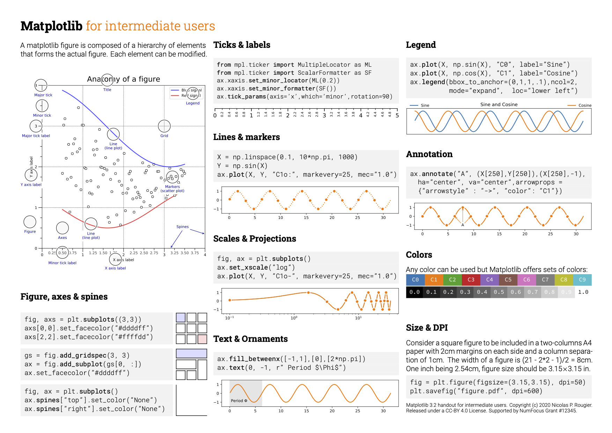

# Matplotlib 简介

Matplotlib是一个Python 2D绘图库，它以多种硬拷贝格式和跨平台的交互式环境生成出版物质量的图形。

## 相关链接

Matplotlib 官网：<https://matplotlib.org/>  
Matplotlib 源代码：<https://github.com/matplotlib/matplotlib>  
Matplotlib 用户指南：<https://mpl.apachecn.org/>
