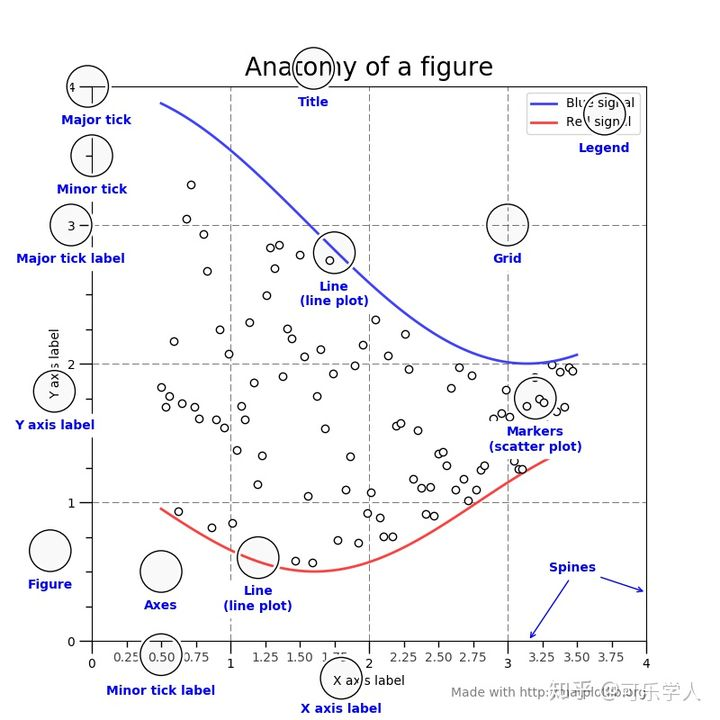
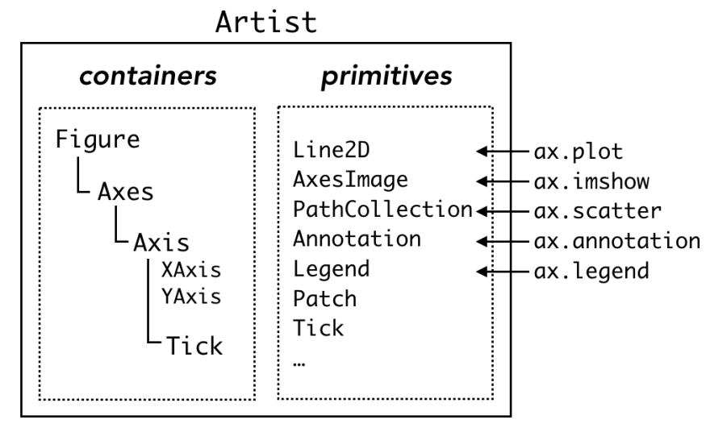

# Matplotlib 基础

## 接口

Matplotlib有两种接口：基于状态绘制(Matlab风格)和基于面向对象。基于Matlab的是pyplot提供的，比较简单；基于面向对象的方法结构清晰，是Matplotlib的精髓。

* 基于状态绘制：自动创建和管理图和坐标系，用pyplot函数作图(pyplot即直接调用封装好的API函数即可直接进行绘图)；
* 基于面向对象：显示创建图和坐标系，再调用对象的方法来作图。

基于状态绘制:

```python
import matplotlib.pyplot as plt

plt.figure(1)
plt.subplot(211)
plt.plot([1,2,3], [1,2,3])
plt.subplot(212)
plt.plot([1,2,3], [1,2,3], 'r--')
plt.show()
```

基于面向对象:

```python
import matplotlib.pyplot as plt

fig, (ax1, ax2) = plt.subplots(2,1)
ax1.plot([1,2,3], [1,2,3])
ax2.plot([1,2,3], [1,2,3], 'r--')
plt.show()
```

## 绘图对象

Matplotlib的所有对象都叫“Artist”，Artist可以分为两大类别：容器类Containers和基础类Primitives。

* 容器类：图(figure)、坐标系(axes)、坐标轴(axis)、刻度(tick)。
* 基础类：线(line)、点(marker)、文字(text)、图例(legend)、网格(grid)、标题(title)。





使用面向对象接口时，正确的作图流程应该是：

1. 创建figure实例
2. 在figure上创建axes
3. 在axes上添加基础类对象
