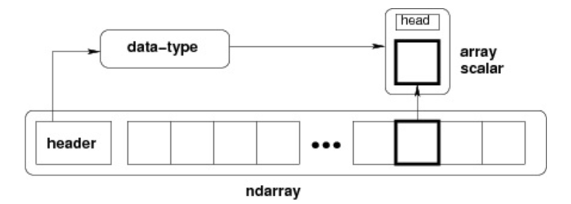

# NumPy Ndarray

NumPy 最重要的一个特点是**其 N 维数组对象 ndarray**，它是一系列同类型数据的集合，**以 0 下标为开始进行集合中元素的索引**。

ndarray 对象是用于存放同类型元素的多维数组。

ndarray 中的每个元素在内存中都有相同存储大小的区域。

## Ndarray 组成

ndarray 内部由以下内容组成：

* 一个指向数据（内存或内存映射文件中的一块数据）的指针。
* 数据类型或 dtype，描述在数组中的固定大小值的格子。
* 一个表示数组形状（shape）的元组，表示各维度大小的元组。
* 一个跨度元组（stride），其中的整数指的是为了前进到当前维度下一个元素需要"跨过"的字节数。

ndarray 的内部结构:



## Ndarray 创建

### array

创建一个 ndarray 只需调用 NumPy 的 array 函数即可：

```python
numpy.array(object, dtype = None, copy = True, order = None, subok = False, ndmin = 0)
```

参数说明：

名称 | 描述
-- | --
object | 数组或嵌套的数列
dtype | 数组元素的数据类型，可选
copy | 对象是否需要复制，可选
order | 创建数组的样式，C为行方向，F为列方向，A为任意方向（默认）
subok | 默认返回一个与基类类型一致的数组
ndmin | 指定生成数组的最小维度

实例 1：

```python
import numpy as np 
a = np.array([1,2,3])  
print (a)
```

输出结果如下：

```python
[1, 2, 3]
```

实例 2:

```python
# 多于一个维度  
import numpy as np 
a = np.array([[1,  2],  [3,  4]])  
print (a)
```

输出结果如下：

```python
[[1, 2] 
 [3, 4]]
```

实例 3:

```python
# 最小维度  
import numpy as np 
a = np.array([1,  2,  3,4,5], ndmin =  2)  
print (a)
```

输出如下：

```python
[[1, 2, 3, 4, 5]]
```

实例 4:

```python
# dtype 参数  
import numpy as np 
a = np.array([1,  2,  3], dtype = complex)  
print (a)
```

输出结果如下：

```python
[ 1.+0.j,  2.+0.j,  3.+0.j]
```

### empty

umpy.empty 方法用来创建一个指定形状（shape）、数据类型（dtype）且未初始化的数组：

```python
numpy.empty(shape, dtype = float, order = 'C')
```

参数说明：

参数 | 描述
-- | --
shape | 数组形状
dtype | 数据类型，可选
order | 有"C"和"F"两个选项,分别代表，行优先和列优先，在计算机内存中的存储元素的顺序。

实例：

```python
import numpy as np 
x = np.empty([3,2], dtype = int) 
print (x)
```

输出结果为：

```python
[[ 6917529027641081856  5764616291768666155]
 [ 6917529027641081859 -5764598754299804209]
 [          4497473538      844429428932120]]
```

注意**数组元素为随机值，因为它们未初始化。**

### zeros

numpy.zeros 创建指定大小的数组，数组元素以 0 来填充。

```python
numpy.zeros(shape, dtype = float, order = 'C')
```

参数说明：

参数 | 描述
-- | --
shape | 数组形状
dtype | 数据类型，可选
order | 'C' 用于 C 的行数组，或者 'F' 用于 FORTRAN 的列数组

实例：

```python
import numpy as np
 
# 默认为浮点数
x = np.zeros(5) 
print(x)
 
# 设置类型为整数
y = np.zeros((5,), dtype = np.int) 
print(y)
 
# 自定义类型
z = np.zeros((2,2), dtype = [('x', 'i4'), ('y', 'i4')])  
print(z)
```

输出结果为：

```python
[0. 0. 0. 0. 0.]
[0 0 0 0 0]
[[(0, 0) (0, 0)]
 [(0, 0) (0, 0)]]
```

### ones

numpy.ones 创建指定形状的数组，数组元素以 1 来填充。

```python
numpy.ones(shape, dtype = None, order = 'C')
```

参数说明：

参数 | 描述
-- | --
shape | 数组形状
dtype | 数据类型，可选
order | 'C' 用于 C 的行数组，或者 'F' 用于 FORTRAN 的列数组

实例:

```python
import numpy as np
 
# 默认为浮点数
x = np.ones(5) 
print(x)
 
# 自定义类型
x = np.ones([2,2], dtype = int)
print(x)
```

输出结果为：

```python
[1. 1. 1. 1. 1.]
[[1 1]
 [1 1]]
```

### asarray

numpy.asarray 类似 numpy.array，但 numpy.asarray 参数只有三个，比 numpy.array 少两个。

```python
numpy.asarray(a, dtype = None, order = None)
```

参数说明：

参数 | 描述
-- | --
a | 任意形式的输入参数，可以是，列表, 列表的元组, 元组, 元组的元组, 元组的列表，多维数组
dtype | 数据类型，可选
order | 可选，有"C"和"F"两个选项,分别代表，行优先和列优先，在计算机内存中的存储元素的顺序。

实例

```python
import numpy as np 
 
x =  [1,2,3] 
a = np.asarray(x)  
print (a)
```

输出结果为：

```python
[1  2  3]
```

### numpy.frombuffer

numpy.frombuffer 用于实现动态数组。

numpy.frombuffer 接受 buffer 输入参数，以流的形式读入转化成 ndarray 对象。

```python
numpy.frombuffer(buffer, dtype = float, count = -1, offset = 0)
```

注意：**buffer 是字符串的时候，Python3 默认 str 是 Unicode 类型，所以要转成 bytestring 在原 str 前加上 b。**

参数说明：

参数 | 描述
-- | --
buffer | 可以是任意对象，会以流的形式读入。
dtype | 返回数组的数据类型，可选
count | 读取的数据数量，默认为-1，读取所有数据。
offset | 读取的起始位置，默认为0。

实例

```python
import numpy as np 
 
s =  b'Hello World' 
a = np.frombuffer(s, dtype =  'S1')  
print (a)
```

输出结果为：

```python
[b'H' b'e' b'l' b'l' b'o' b' ' b'W' b'o' b'r' b'l' b'd']
```

### numpy.fromiter

numpy.fromiter 方法从可迭代对象中建立 ndarray 对象，返回一维数组。

```python
numpy.fromiter(iterable, dtype, count=-1)
```

参数 | 描述
-- | --
iterable | 可迭代对象
dtype | 返回数组的数据类型
count | 读取的数据数量，默认为-1，读取所有数据

实例

```python
import numpy as np 
 
# 使用 range 函数创建列表对象  
list=range(5)
it=iter(list)

# 使用迭代器创建 ndarray 
x=np.fromiter(it, dtype=float)
print(x)
```

输出结果为：

```python
[0. 1. 2. 3. 4.]
```

### numpy.arange

numpy 包中的使用 arange 函数创建数值范围并返回 ndarray 对象，函数格式如下：

```python
numpy.arange(start, stop, step, dtype)
# 根据 start 与 stop 指定的范围以及 step 设定的步长，生成一个 ndarray。
```

参数说明：

参数 | 描述
-- | --
start | 起始值，默认为0
stop | 终止值（不包含）
step | 步长，默认为1
dtype | 返回ndarray的数据类型，如果没有提供，则会使用输入数据的类型。

实例:生成 0 到 5 的数组:

```python
import numpy as np
 
x = np.arange(5)  
print (x)
```

输出结果如下：

```python
[0  1  2  3  4]
```

### numpy.linspace

numpy.linspace 函数用于创建一个一维数组，数组是一个等差数列构成的，格式如下：

np.linspace(start, stop, num=50, endpoint=True, retstep=False, dtype=None)
参数说明：

参数 | 描述
start | 序列的起始值
stop | 序列的终止值，如果endpoint为true，该值包含于数列中
num | 要生成的等步长的样本数量，默认为50
endpoint | 该值为 true 时，数列中包含stop值，反之不包含，默认是True。
retstep | 如果为 True 时，生成的数组中会显示间距，反之不显示。
dtype | ndarray 的数据类型

以下实例用到三个参数，设置起始点为 1 ，终止点为 10，数列个数为 10。

```python
import numpy as np
a = np.linspace(1,10,10)
print(a)
```

输出结果为：

```python
[ 1.  2.  3.  4.  5.  6.  7.  8.  9. 10.]
```

设置元素全部是1的等差数列：

```python
import numpy as np
a = np.linspace(1,1,10)
print(a)
```

输出结果为：

```python
[1. 1. 1. 1. 1. 1. 1. 1. 1. 1.]
```

将 endpoint 设为 false，不包含终止值：

```python
import numpy as np
 
a = np.linspace(10, 20,  5, endpoint =  False)  
print(a)
```

输出结果为：

```python
[10. 12. 14. 16. 18.]
```

如果将 endpoint 设为 true，则会包含 20。

以下实例设置间距。

实例

```python
import numpy as np
a =np.linspace(1,10,10,retstep= True)
 
print(a)
# 拓展例子
b =np.linspace(1,10,10).reshape([10,1])
print(b)
```

输出结果为：

```python
(array([ 1.,  2.,  3.,  4.,  5.,  6.,  7.,  8.,  9., 10.]), 1.0)
[[ 1.]
 [ 2.]
 [ 3.]
 [ 4.]
 [ 5.]
 [ 6.]
 [ 7.]
 [ 8.]
 [ 9.]
 [10.]]
```

### numpy.logspace

numpy.logspace 函数用于创建一个等积数列。格式如下：

```python
np.logspace(start, stop, num=50, endpoint=True, base=10.0, dtype=None)
# base 参数意思是取对数的时候 log 的下标。
```

参数 | 描述
-- | --
start | 序列的起始值为：base ** start
stop | 序列的终止值为：base ** stop。如果endpoint为true，该值包含于数列中
num | 要生成的等步长的样本数量，默认为50
endpoint | 该值为 true 时，数列中中包含stop值，反之不包含，默认是True。
base | 对数 log 的底数。
dtype | ndarray 的数据类型

```python
import numpy as np
# 默认底数是 10
a = np.logspace(1.0,  2.0, num =  10)  
print (a)
```

输出结果为：

```python
[ 10.           12.91549665     16.68100537      21.5443469  27.82559402      
  35.93813664   46.41588834     59.94842503      77.42636827    100.    ]
```

将对数的底数设置为 2 :

```python
import numpy as np
a = np.logspace(0,9,10,base=2)
print (a)
```

输出如下：

```python
[  1.   2.   4.   8.  16.  32.  64. 128. 256. 512.]
```

## 副本和视图

副本是一个数据的完整的拷贝，如果我们对副本进行修改，它不会影响到原始数据，物理内存不在同一位置。

视图是数据的一个别称或引用，通过该别称或引用亦便可访问、操作原有数据，但原有数据不会产生拷贝。如果我们对视图进行修改，它会影响到原始数据，物理内存在同一位置。

视图一般发生在：

1. numpy 的切片操作返回原数据的视图。
2. 调用 ndarray 的 view() 函数产生一个视图。

副本一般发生在：

* Python 序列的切片操作，调用deepCopy()函数。
* 调用 ndarray 的 copy() 函数产生一个副本。

### 无复制

简单的赋值不会创建数组对象的副本。 相反，它使用原始数组的相同id()来访问它。 id()返回 Python 对象的通用标识符，类似于 C 中的指针。

此外，一个数组的任何变化都反映在另一个数组上。 例如，一个数组的形状改变也会改变另一个数组的形状。

```python
import numpy as np 
 
a = np.arange(6)  
print ('我们的数组是：')
print (a)
print ('调用 id() 函数：')
print (id(a))
print ('a 赋值给 b：')
b = a 
print (b)
print ('b 拥有相同 id()：')
print (id(b))
print ('修改 b 的形状：')
b.shape =  3,2  
print (b)
print ('a 的形状也修改了：')
print (a)
```

输出结果为：

```python
我们的数组是：
[0 1 2 3 4 5]
调用 id() 函数：
4349302224
a 赋值给 b：
[0 1 2 3 4 5]
b 拥有相同 id()：
4349302224
修改 b 的形状：
[[0 1]
 [2 3]
 [4 5]]
a 的形状也修改了：
[[0 1]
 [2 3]
 [4 5]]
```

### 视图或浅拷贝

ndarray.view() 方会创建一个新的数组对象，该方法创建的新数组的维数更改不会更改原始数据的维数。

```python
import numpy as np 
 
# 最开始 a 是个 3X2 的数组
a = np.arange(6).reshape(3,2)  
print ('数组 a：')
print (a)
print ('创建 a 的视图：')
b = a.view()  
print (b)
print ('两个数组的 id() 不同：')
print ('a 的 id()：')
print (id(a))
print ('b 的 id()：' )
print (id(b))
# 修改 b 的形状，并不会修改 a
b.shape =  2,3
print ('b 的形状：')
print (b)
print ('a 的形状：')
print (a)
```

输出结果为：

```python
数组 a：
[[0 1]
 [2 3]
 [4 5]]
创建 a 的视图：
[[0 1]
 [2 3]
 [4 5]]
两个数组的 id() 不同：
a 的 id()：
4314786992
b 的 id()：
4315171296
b 的形状：
[[0 1 2]
 [3 4 5]]
a 的形状：
[[0 1]
 [2 3]
 [4 5]]
```

使用切片创建视图修改数据会影响到原始数组：

```python
import numpy as np 
 
arr = np.arange(12)
print ('我们的数组：')
print (arr)
print ('创建切片：')
a=arr[3:]
b=arr[3:]
a[1]=123
b[2]=234
print(arr)
print(id(a),id(b),id(arr[3:]))
```

输出结果为：

```python
我们的数组：
[ 0  1  2  3  4  5  6  7  8  9 10 11]
创建切片：
[  0   1   2   3 123 234   6   7   8   9  10  11]
4545878416 4545878496 4545878576
```

变量 a,b 都是 arr 的一部分视图，对视图的修改会直接反映到原数据中。但是我们观察 a,b 的 id，他们是不同的，也就是说，视图虽然指向原数据，但是他们和赋值引用还是有区别的。

### 副本或深拷贝

ndarray.copy() 函数创建一个副本。 对副本数据进行修改，不会影响到原始数据，它们物理内存不在同一位置。

```python
import numpy as np 
 
a = np.array([[10,10],  [2,3],  [4,5]])  
print ('数组 a：')
print (a)
print ('创建 a 的深层副本：')
b = a.copy()  
print ('数组 b：')
print (b)
# b 与 a 不共享任何内容  
print ('我们能够写入 b 来写入 a 吗？')
print (b is a)
print ('修改 b 的内容：')
b[0,0]  =  100  
print ('修改后的数组 b：')
print (b)
print ('a 保持不变：')
print (a)
```

输出结果为：

```python
数组 a：
[[10 10]
 [ 2  3]
 [ 4  5]]
创建 a 的深层副本：
数组 b：
[[10 10]
 [ 2  3]
 [ 4  5]]
我们能够写入 b 来写入 a 吗？
False
修改 b 的内容：
修改后的数组 b：
[[100  10]
 [  2   3]
 [  4   5]]
a 保持不变：
[[10 10]
 [ 2  3]
 [ 4  5]]
 ```
